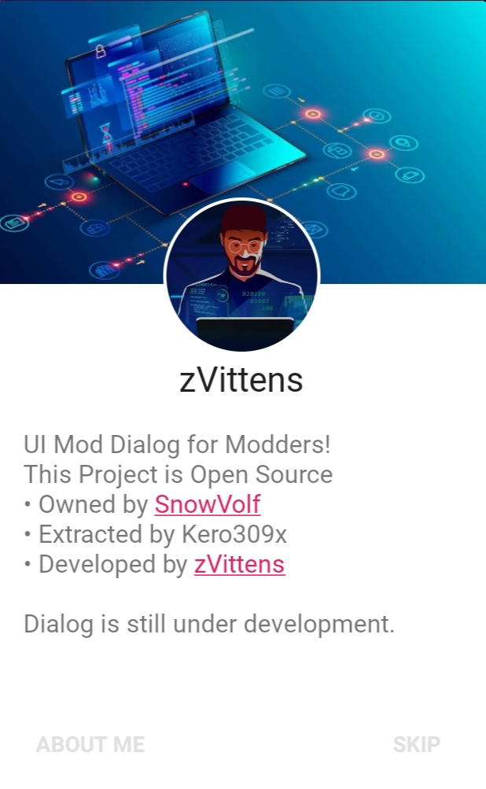

<p align="center">
  
  <h1 align="center">Mod Dialog</h1>
  <p align="center">Mod Dialog SOURCE CODE for Modders</p>
</p>

<p align="center">
    
</p>

<p align="center">
    
    
    
    
</p>

<p align="center">
    
</p>

---
## Move an Assets
In this repository there is an `Assets` folder, you should move this folder which contains:
- `about_info.txt`
- `font.ttf`
- `pcover.webp`
- `pprofile.webp`

Move all these files into your own app project, you can also edit or replace them.

## Smali Folder
The `smali` folder must be compressed into a `.zip`

## Dialog Type

If you want to use limited dialog, you have to use the following code:

```
invoke-static/range {p0 .. p0}, Lmeh/vittens/moddialog/ModDialog;->prepare(Landroid/app/Activity;)V
```

If you want to use unlimited dialog, you have to use the following code:

```
invoke-static/range {p0 .. p0}, Lmeh/vittens/moddialog/ModDialog;->showCrackerDialog(Landroid/content/Context;)V
```

`Limited Dialog` has the following system:
- A dialog will appear on the first launch of the application.
- This dialog will appear only once, if you have opened the first application then the second time it will not appear again.

`Unlimited Dialog` has the following system:
- A dialog will appear on the first launch of the application.
- This dialog will appear repeatedly, if you have opened the first application then the second time it will appear again.

## Code Location
Once you have defined both types of code, you should paste this code into the `onCreate` section of any activity such as `MainActivity`.

---

## Results

<p align="center">
  
</p>

<p align="center">You can develop this project, if the results are not interesting 😉</p>

---
